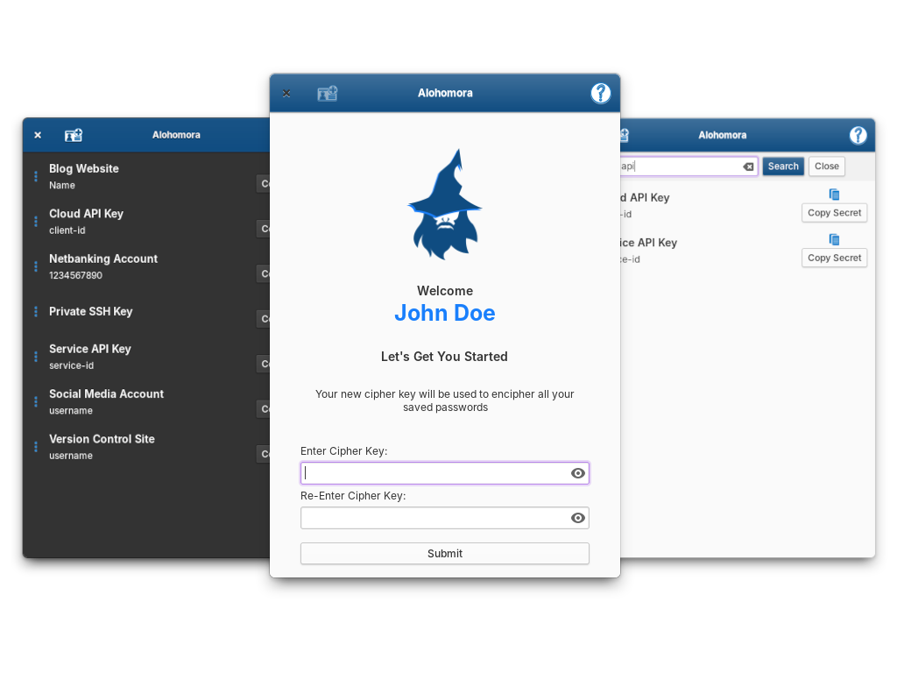

# Alohomora

[](https://github.com/z0o0p/alohomora/blob/master/COPYING)
[](https://travis-ci.com/z0o0p/alohomora)
[](https://github.com/z0o0p/alohomora/issues)

Alohomora is a free and open-source password manager designed for elementary OS and built using Vala and Gtk. It manages your passwords in a user-friendly manner while ensuring security.

Alohomora leverages the libsecret-1 library package to store passwords securely into the device keyring.



## Get it from elementary OS AppCenter!

[](https://appcenter.elementary.io/com.github.z0o0p.alohomora)

This app is available on the elementary OS AppCenter. Head over there to download and install Alohomora.

## Building and Installation

You can build and install Alohomora from the source. Ensure that you have the required dependencies installed.

### Required Dependencies

* meson
* valac 
* libgtk-3-dev
* libgranite-dev
* libsecret-1-dev

### Build, install and run

```bash
# Clone repository and build application
git clone https://github.com/z0o0p/alohomora.git
cd alohomora
meson build --prefix=/usr
```


```bash
# Install and run application
cd build
ninja && sudo ninja install
./com.github.z0o0p.alohomora
```

## Contributions <3
Anyone willing to contribute to this project is most welcome. Please refer to the [contributing guidelines](https://github.com/z0o0p/alohomora/blob/master/CONTRIBUTING.md) to get started.